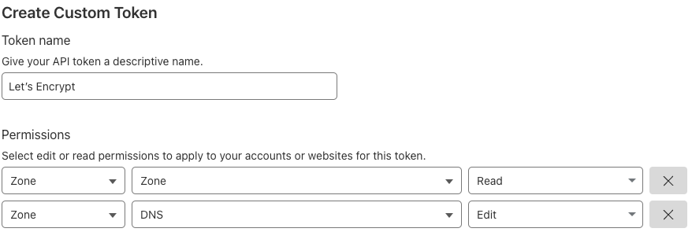

# Install OpenShift cert-manager operator

First, You need to install cert-manager in your Openshift cluster.

# Configure and deploy an ACME issuer (Let’s Encrypt) to solve cloudflare DNS challenges

## Create a Cloudflare Api token

Go to Cloudflare dashboard > Profile (Right top corner) > API Tokens. Click Create Token button and Create custom token button. And then, fill Permission section form below. And then, fill Permission section form like below. Finally, copy the Cloudflare API token.



## Create the Cloudflare API token secret

Open [cloudflare-api-token-secret.yml](cloudflare-api-token-secret.yml), and replace  <Cloudflare API token> with your Cloudflare API token.
Then, run the following command:

```sh
oc apply -f cloudflare-api-token-secret.yml
```

## Deploy ClustterIssuer with Cloudflare DNS challenges

Open [letsEncrypt-cloudflare-clusterIssuer.yml](letsEncrypt-cloudflare-clusterIssuer.yml), and replace:

- *your-letsencrypt-email@example.com* with your Let's Encrypt Email
- *your-cloudflare-email@example.com* with your Cloudflare Email

Then, run the following command:

```sh
oc apply -f letsEncrypt-cloudflare-clusterIssuer.yml
```

# Create and add the API server Certificate

## Create the API server Certificate

Open [api-server-tls-certificate.yml](api-server-tls-certificate.yml), and replace <cluster_base_domain> with your DNS name.
Then, run the following command:

```sh
oc create -f api-server-tls-certificate.yml
```

## Replace the API server Certificate

Replace <cluster_base_domain> with your DNS name, and run the following command to update the API server with a reference to the secret created by the API server Certificate

```sh
oc patch apiserver cluster --type=merge --patch='{"spec": {"servingCerts": {"namedCertificates": [{"names": [" 'api.<cluster_base_domain>' "], "servingCertificate": {"name": "api-server-certs"}}]}}}'
```

More info here :

- https://docs.openshift.com/container-platform/4.18/security/cert_manager_operator/cert-manager-creating-certificate.html#cert-manager-certificate-api-server_cert-manager-creating-certificate
- https://docs.openshift.com/container-platform/4.18/security/certificates/api-server.html#customize-certificates-api-add-named_api-server-certificates

# Create and replace the default Ingress Controller Certificate

## Create the Ingress Controller Certificate

Open [ingress-controller-tls-certificate.yml](ingress-controller-tls-certificate.yml), and replace <cluster_base_domain> with your DNS name.
Then, run the following command:

```sh
oc create -f ingress-controller-tls-certificate.yml
```

## Replace the default ingress controller certificate

Run the following command to update the Ingress Controller configuration with the newly created secret by the Ingress Controller Certificate

```sh
oc patch ingresscontroller default --type=merge --patch='{"spec": { "defaultCertificate": { "name": "ingress-controller-certs" }}}' -n openshift-ingress-operator
```

More info here :

- https://docs.openshift.com/container-platform/4.18/security/cert_manager_operator/cert-manager-creating-certificate.html#cert-manager-certificate-ingress_cert-manager-creating-certificate
- https://docs.openshift.com/container-platform/4.18/security/certificates/replacing-default-ingress-certificate.html#replacing-default-ingress
